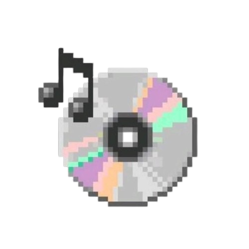

<!-- PROJECT LOGO -->
<br />
<div align="center">
  <a href="https://anibeat-with-react.web.app/">
    
  </a>

  <h3 align="center">AniBeat</h3>

  <p align="center">
    A modern, community-driven platform for anime music lovers — inspired by osu!, AniList, and Spotify Wrapped.
    <br />
    <a href="https://github.com/miguelangelraazaraujo-hub/AniBeat-with-React"><strong>Explore the docs »</strong></a>
    <br />
    <br />
    <a href="https://www.anibeat.com">View Demo</a>
    ·
    <a href="https://github.com/miguelangelraazaraujo-hub/AniBeat-with-React/issues">Report Bug</a>
    ·
    <a href="https://github.com/miguelangelraazaraujo-hub/AniBeat-with-React/issues">Request Feature</a>
  </p>
</div>

<!-- TABLE OF CONTENTS -->
<details>
  <summary>Table of Contents</summary>
  <ol>
    <li><a href="#about-the-project">About The Project</a></li>
    <li><a href="#features">Features</a></li>
    <li><a href="#built-with">Built With</a></li>
    <li><a href="#tutorials--resources">Tutorials & Resources</a></li>
    <li><a href="#getting-started">Getting Started</a></li>
    <li><a href="#firebase-hosting">Firebase Hosting</a></li>
    <li><a href="#rss-feed">RSS Feed</a></li>
    <li><a href="#contact">Contact</a></li>
  </ol>
</details>

<!-- ABOUT THE PROJECT -->
## About The Project

AniBeat is a dynamic web platform dedicated to anime music enthusiasts. It combines the sleek data visualization of **Spotify Wrapped** and **Microsoft Edge | Year in Review**, the community features of **AniList**, and the energetic UI/UX of **osu!** to create a unique space where users can:

- Discover new anime tracks and artists  
- Build and manage personal playlists ("My Playlist")  
- Track their listening history and stats  
- Engage with a community through fanarts, forums, and contests  
- Experience seasonal recaps like "AniBeat Wrapped"

Designed with a dark theme, smooth animations, and responsive layouts, AniBeat offers an immersive experience that feels both familiar and fresh.

---

## Features

- ✅ **Personal Playlist CRUD**: Create, read, update, and delete your favorite anime tracks using `localStorage`.
- 🌐 **Multi-language Support**: Switch between languages with a flag-based selector (i18n via `react-i18next`).
- 📱 **Fully Responsive Design**: Mobile-first header with hamburger menu and expandable sections.
- 🧭 **Interactive Navigation**: Hover-activated mega-menus on desktop, tap-to-expand on mobile.
- 📊 **Dynamic Content Sections**: News feed, featured maps, daily challenges, and popular tracks.
- 🔒 **Legal Compliance**: Full GDPR-ready pages: Cookie Policy, Privacy Policy, and Terms of Sale.
- 🗺️ **Location-aware Features**: Integrated map views using **Leaflet** for community events or artist locations.
- 🎨 **Modern UI**: Gradient headers, animated overlays, and card-based layouts inspired by osu! and Spotify.
- 📝 **Forum with Firebase CRUD**: Create, update, delete, and search posts dynamically with images.
- 📰 **RSS Feed Support**: Export project news/posts via RSS feed.

---

## Built With

This project was built using modern web technologies and third-party libraries:

- **[React](https://react.dev/)** – Frontend framework for building user interfaces.
- **[react-i18next](https://react.i18next.com/)** – Internationalization for multi-language support.
- **[Font Awesome](https://fontawesome.com/)** – Icons for navigation, buttons, and UI elements.
- **[Leaflet](https://leafletjs.com/)** – Open-source JavaScript library for mobile-friendly interactive maps.
- **[Vite](https://vitejs.dev/)** – Next-gen build tool for fast development and bundling.
- **Pure CSS** – Custom styling without heavy frameworks, ensuring full control over design.

---

## Tutorials & Resources

The following resources were instrumental during development:

- 📄 **[Best README Template](https://github.com/othneildrew/Best-README-Template)** – For structuring this documentation.
- 🎮 **[osu! Website](https://osu.ppy.sh/)** – Reference for mega-menu behavior, header animations, and sidebar layout.
- 📺 **[Spotify Wrapped](https://spotify.com/wrapped)** – Inspiration for data storytelling and visual summaries.
- 📚 **[AniList](https://anilist.co/)** – Model for community-driven content and user profiles.
- 🖥️ **[Microsoft Edge | Year in Review](https://edge.microsoft.com/yearinreview/)** – Guide for immersive, scroll-driven narratives.
- 🧩 **[AniGuessr](https://aniguessr.com/)** – Example of gamified anime/music interaction.
- 🗺️ **[Leaflet Quick Start Guide](https://leafletjs.com/examples/quick-start/)** – For implementing interactive maps.

---

## Getting Started

To run AniBeat locally:

### Prerequisites
- Node.js (v18+)
- npm or pnpm

### Installation
1. Clone the repo
   ```sh
   git clone https://github.com/miguelangelraazaraujo-hub/AniBeat-with-React.git

2. Install dependencies
    npm install
    # or
    pnpm install

3. Start the development server
    npm run dev

4. Open http://localhost:5173 in your browser.
    💡 No backend required — all data is stored in localStorage.

## Firebase Hosting
The project is hosted on Firebase Hosting:
- 🌐 Live Site: [AniBeat on Firebase](https://anibeat-with-react.web.app/)
Firebase allows dynamic content via Firestore for forum posts and handles hosting of static assets, including the RSS XML.store

## RSS Feed
AniBeat now includes an RSS feed for news updates and forum posts:
- 📄 RSS XML: [RSS Feed](https://anibeat-with-react.web.app/rss.xml)

### RSS Testing
The RSS feed was verified using RSS Viewer, ensuring the XML is properly parsed and displayed.
- All posts appear in chronological order based on createdAt.
- Images, titles, and categories are correctly extracted.
This ensures that external RSS readers can consume AniBeat updates correctly.

Below is a screenshot showing the RSS feed opened in Feedly and displaying the news items from the application.


### Contact
Have questions or want to collaborate? Reach out!
- Project Link: https://github.com/miguelangelraazaraujo-hub/AniBeat-with-React.git
- Website: https://anibeat-with-react.web.app/
Made with ❤️ for the anime and rhythm game community.